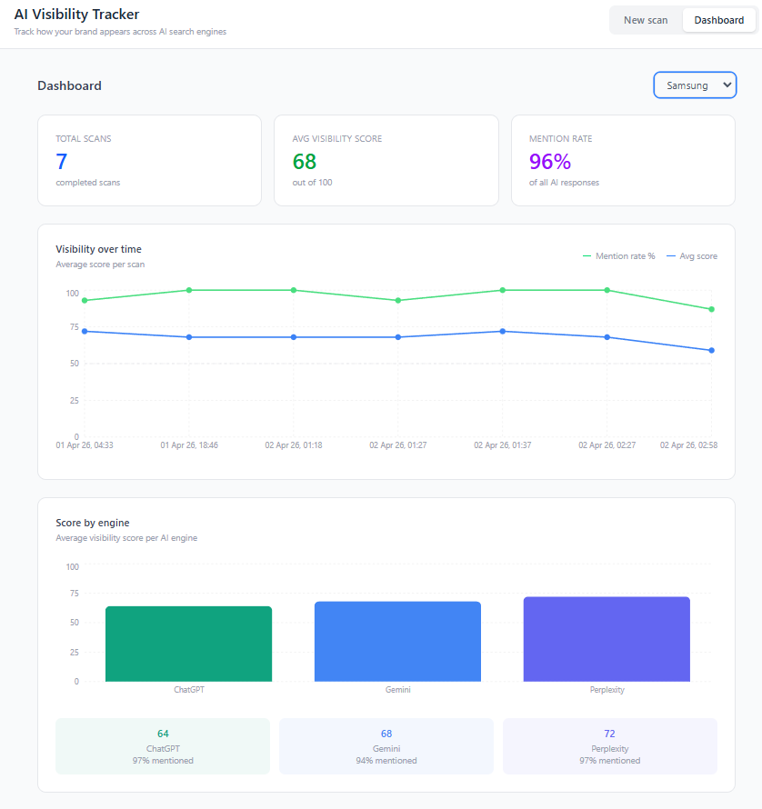

# AI Visibility Tracker

Track how your brand appears across AI search engines like ChatGPT, Gemini, and Perplexity — and watch visibility change over time.

Built as a portfolio project to demonstrate full-stack skills with NestJS, React, Firestore, and AI orchestration.



---

## What it does

- Run a scan for any brand + category (e.g. "Bosch" + "home appliances")
- Fires up to 15 prompts across 3 simulated AI engine personas (configurable via env vars)
- Parses each response: was the brand mentioned? at what position? positive or negative sentiment?
- Calculates a visibility score (0–100) per response
- Stores all results in Firestore and aggregates them over time
- Displays a live dashboard: score timeline, engine breakdown, mention rate

---

## Tech stack

| Layer    | Technology                       |
| -------- | -------------------------------- |
| Backend  | NestJS + TypeScript              |
| Frontend | React + Vite + Tailwind          |
| Database | Firebase Firestore               |
| AI       | Claude Haiku (Anthropic) via SDK |
| Alt AI   | OpenRouter (free models for dev) |
| Charts   | Recharts                         |

---

## Architecture

```
React (Vite)
    │
    │  REST API
    ▼
NestJS
    ├── ScansModule      POST /api/scans
    ├── AnalyticsModule  GET  /api/analytics
    └── AIService
            ├── runScan()    (orchestrates N prompts × M engines, batched)
            ├── Parser       (mention, position, sentiment, score)
            └── Providers
                    ├── Claude Haiku (Anthropic)
                    └── OpenRouter   (free models)
    │
    ▼
Firestore
    brands/{brandId}
        scans/{scanId}
            results/{resultId}
```

---

## Getting started

### Prerequisites

- Node.js 18+
- A Firebase project with Firestore enabled
- An Anthropic API key
- OR an OpenRouter API key (free models available at openrouter.ai)

### 1. Clone and install

```bash
git clone https://github.com/AlaaJanadi/ai-visibility-tracker
cd ai-visibility-tracker

npm install --workspace=backend
npm install --workspace=frontend
```

### 2. Configure the backend

```bash
cp backend/.env.example backend/.env
```

Fill in `backend/.env`:

```env
ANTHROPIC_API_KEY=your_key_here
OPENROUTER_API_KEY=your_key_here

AI_PROVIDER=openrouter               # or 'anthropic'
OPENROUTER_MODEL=meta-llama/llama-3.3-70b-instruct:free
ANTHROPIC_MODEL=claude-haiku-4-5

# Scan scope (default: 2 engines × 2 prompts = 4 calls per scan)
AI_MAX_ENGINES=2
AI_MAX_PROMPTS=2
AI_CONCURRENCY=1
AI_DELAY_MS=2500

# CORS (set to your production frontend URL before deploying)
FRONTEND_URL=http://localhost:5173

# Rate limiting on POST /api/scans (5 requests per IP per minute)
THROTTLE_TTL_MS=60000
THROTTLE_SCAN_LIMIT=5
```

Add your Firebase service account key:

- Go to Firebase Console → Project Settings → Service Accounts
- Click "Generate new private key"
- Save the file as `backend/serviceAccountKey.json`

### 3. Configure the frontend

```bash
cp frontend/.env.example frontend/.env
```

`frontend/.env` contains:

```env
VITE_API_URL=http://localhost:3000/api
```

### 4. Run

```bash
# terminal 1 — backend
cd backend && npm run start:dev

# terminal 2 — frontend
cd frontend && npm run dev
```

Open http://localhost:5173

---

## How a scan works

1. User submits a brand name and category
2. Backend creates a scan document in Firestore with status `running`
3. `AIService.runScan()` builds N tasks (AI_MAX_PROMPTS × AI_MAX_ENGINES, default 2×2=4)
4. Tasks fire in controlled batches (AI_CONCURRENCY) with AI_DELAY_MS gaps between batches
5. Each response is parsed: mention detection, position extraction, sentiment analysis
6. A visibility score (0–100) is calculated based on position + sentiment
7. All results are batch-written to Firestore atomically
8. Scan status updates to `done`
9. Frontend fetches results and displays them

---

## Key engineering decisions

**Lazy promise evaluation** — tasks are wrapped in `() => promise` functions so the concurrency limiter controls exactly when each HTTP request fires. Firing all 15 at once exceeded the API's concurrent connection limit.

**Firestore batch writes** — all 15 results are committed in a single batch operation rather than 15 sequential writes. Atomic and ~15x faster.

**Provider abstraction** — a single `callLLM()` method routes to either Anthropic or OpenRouter based on an env variable. Adding a new provider is a one-file change.

**Lexicon-based sentiment** — sentiment is detected using a word list rather than a second LLM call. Fast, deterministic, and free.

---

## Project structure

```
ai-visibility-tracker/
├── backend/
│   └── src/
│       ├── ai/           ← orchestrator, parser, prompts
│       ├── analytics/    ← GET /api/analytics
│       ├── common/       ← shared TypeScript types
│       ├── firebase/     ← Firestore client
│       └── scans/        ← POST /api/scans
└── frontend/
    └── src/
        ├── api/          ← typed axios client
        ├── components/   ← ScanForm, ResultsTable, charts
        ├── hooks/        ← useAsync
        └── pages/        ← Dashboard
```
